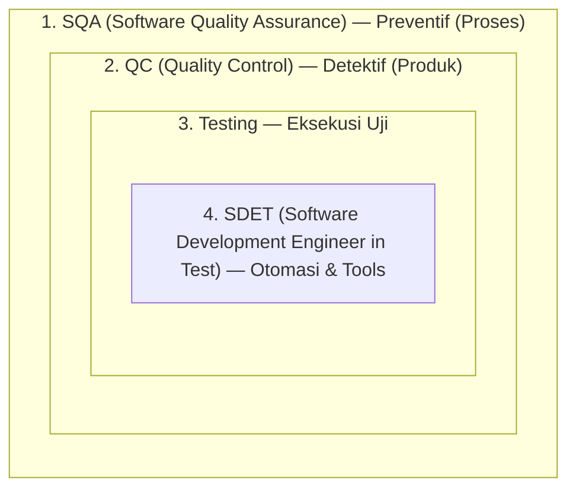
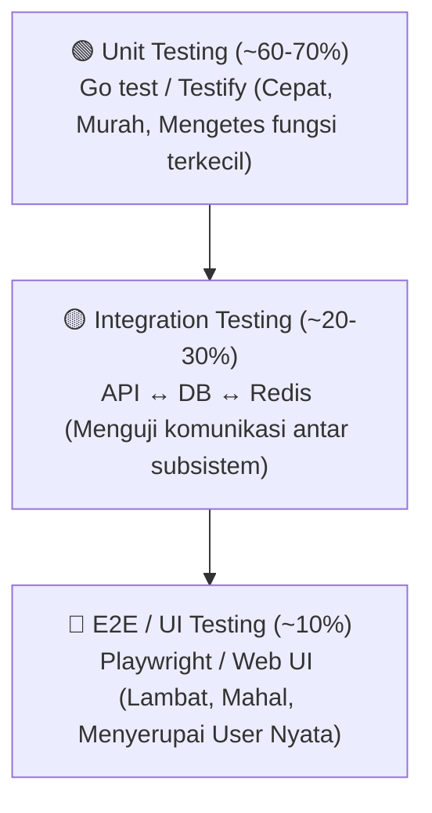

# 📘 Modul 1: QA Fundamentals & Test Engineering Mindset
> **Tanggal Catatan**: 2026-09-09  
> **Target Aplikasi**: [Lumiina Live](https://lumiina-art.vercel.app)  
> **Acuan Standar**: ISTQB (International Software Testing Qualifications Board)

---

## 1. Filosofi & Biaya Kualitas (Cost of Quality)

- **Mengapa Software Memiliki Bug?**
  - Tekanan waktu (*deadline* ketat).
  - Kebutuhan bisnis yang ambigu (*vague requirements*).
  - Kompleksitas sistem modern (Frontend SPA, Backend Microservices, DB Connection Pooling, Redis Cache, Storage Cloud).
- **Rule of Ten (Biaya Memperbaiki Bug)**:
  - Fase Desain / Analisis: **$10**
  - Fase Koding / Dev: **$100**
  - Fase Testing / QA: **$1,000**
  - Fase Production / Live: **$10,000+** (hilang reputasi, data breach, sistem down).
- **Shift-Left Testing**:
  - Melibatkan QA sedini mungkin di sisi kiri siklus pembangunan software untuk mencegah cacat sebelum developer mulai menulis baris kode pertama.

---

## 2. Empat Kasta Kualitas Perangkat Lunak

1. **SQA (Quality Assurance)**: Fokus pada proses (aturan PR, code review guidelines, security standard).
2. **QC (Quality Control)**: Fokus pada produk akhir sebelum rilis.
3. **Software Tester**: Eksekutor pengujian fungsional dan pelapor bug.
4. **SDET**: Engineer pengembang sistem otomasi pengujian, pipeline CI/CD, dan harness pengujian skala besar.

---

## 3. 7 Prinsip Pengujian (ISTQB Standard)

1. **Testing shows the presence of defects, not their absence**: Testing membuktikan adanya bug, bukan menjamin 100% bebas bug.
2. **Exhaustive testing is impossible**: Menguji semua kombinasi input itu mustahil; diperlukan teknik sampling cerdas (EP & BVA).
3. **Early testing saves time and money**: Pengujian dini mencegah biaya perbaikan bengkak di production.
4. **Defect clustering**: 80% bug biasanya berkumpul di 20% modul yang paling kompleks (Prinsip Pareto).
5. **Pesticide paradox**: Skenario uji yang sama berulang kali tidak akan menemukan bug baru; test case harus terus dievaluasi.
6. **Testing is context dependent**: Pengujian platform galeri seni (Lumiina) berbeda pendekatannya dengan sistem perbankan atau perangkat medis.
7. **Absence-of-errors fallacy**: Aplikasi bebas bug tetap dianggap gagal jika tidak memenuhi kebutuhan pengguna nyata.

---

## 4. Siklus Hidup: SDLC vs STLC

| Fase SDLC | Fase STLC Padanannya | Output Dokumen / Aksi |
|---|---|---|
| **Requirement Gathering** | **Requirement Analysis** | Analisis dokumen spesifikasi, identifikasi celah & skenario edge |
| **System Design** | **Test Planning** | Dokumen Test Plan (Scope, Tools, Jadwal, Resiko) |
| **Development (Coding)** | **Test Case Development** | Menulis Test Cases & Test Data (Positive, Negative, Boundary) |
| **Internal Testing** | **Test Environment & Execution** | Menjalankan uji (Manual/Automation), mencatat tiket bug |
| **Deployment / Release** | **Test Closure** | Test Summary Report, evaluasi metrik kelulusan rilis |

---

## 5. The Test Pyramid (Piramida Pengujian)

---

## 6. Terminologi Pengujian Kritis

- **Smoke Testing**: Uji kilat (lebar tapi dangkal) untuk memastikan sistem build baru "menyala" dan stabil untuk diuji lebih lanjut.
- **Sanity Testing**: Uji terfokus (sempit tapi mendalam) pada modul spesifik yang baru saja diperbaiki bug-nya.
- **Regression Testing**: Uji menyeluruh untuk memastikan penambahan/perubahan fitur baru tidak merusak fitur-fitur lama yang sudah stabil.
