# 🎯 QA & SDET Engineering Masterclass: Zero to Hero Roadmap
> **Kurikulum Lengkap, Terstruktur, dan Berstandar Industri Global**  
> **Target Aplikasi Pengujian**: [Lumiina Live Production](https://lumiina-art.vercel.app)  
> **Repository Portofolio Mandiri**: `Nyanns/lumiina-qa-automation`  
> **Acuan Standar**: [roadmap.sh/qa](https://roadmap.sh/qa) & ISTQB (International Software Testing Qualifications Board)

---

## 🧭 Executive Summary: "Taktik Mourinho" (The Unfair Advantage)

Di pasar kerja, pelamar QA umumnya terbagi menjadi 2 kategori:
1. **Manual QA murni**: Hanya bisa klik-klik UI, tidak paham API, tidak bisa coding, dan tidak tahu jeroan server.
2. **Automation QA pemula**: Hanya bisa menulis script dasar dengan Python/Java, tapi buta arsitektur backend, tidak paham database query, dan tidak paham celah keamanan.

**Posisi Sandi (The Rare Profile):**
- 🎓 **S1 Informatika (CS Degree)**: Fondasi algoritma, struktur data, dan rekayasa perangkat lunak yang matang.
- 🛡️ **Cybersecurity Background (HTB Level 10)**: Insting adversarial tajam, terbiasa mencari celah, edge cases, dan logic flaws.
- ⚡ **Go Backend Builder**: Paham persis cara kerja REST API, JWT lifecycle, GORM, database connection pooling, Redis caching, hingga rate limiting karena **membangunnya sendiri dari nol**.
- 🚀 **Automation Engineer**: Mampu mengotomasi API (Postman/Newman) dan Web UI (Playwright) dengan arsitektur standar industri (Page Object Model & CI/CD).

> **Kalimat Sakti Wawancara:**  
> *"Saya tidak hanya menguji aplikasi dari luar, tetapi saya memahami anatomi kode, siklus data di database, dan potensi celah arsitektur hingga ke baris terdalam karena saya sendiri yang membangun backend dan infrastrukturnya."*

---

## 🗺️ Peta Perjalanan Belajar (Milestone Roadmap)

```mermaid
flowchart TD
    M1["🟢 Sesi 1: QA Fundamentals & Mindset<br/>• SDLC vs STLC<br/>• 7 Prinsip Testing (ISTQB)<br/>• Test Levels & Test Types"]
    M2["🟢 Sesi 2: Test Design Techniques<br/>• Equivalence Partitioning (EP)<br/>• Boundary Value Analysis (BVA)<br/>• Decision Table & State Transition"]
    M3["🟡 Sesi 3: Test Documentation & Matrix<br/>• Test Plan & Test Scenarios<br/>• Test Case Matrix (Positive/Negative/Edge)<br/>• RTM (Requirement Traceability Matrix)"]
    M4["🟡 Sesi 4: Bug Tracking & Defect Lifecycle<br/>• Defect Lifecycle (New -> Closed)<br/>• Severity vs Priority Matrix<br/>• Industry-Standard Bug Reporting (Jira)"]
    M5["🟠 Sesi 5: API Testing Automation<br/>• HTTP Anatomy & Status Codes<br/>• Postman Automated Assertions (Chai JS)<br/>• Token Chaining & Newman CLI Reports"]
    M6["🔴 Sesi 6: Web UI E2E Automation (Playwright)<br/>• Architecture, Locators & Auto-waiting<br/>• Page Object Model (POM)<br/>• Authentication State & Trace Viewer"]
    M7["🔴 Sesi 7: Performance & Stress Testing<br/>• k6 Load, Stress, & Spike Testing<br/>• Latency Analysis (p95, p99, throughput)"]
    M8["🟣 Sesi 8: QA CI/CD & GitHub Actions<br/>• Automated Pipeline per PR/Push<br/>• Scheduled Nightly Regression<br/>• Allure / Playwright HTML Test Dashboard"]
    M9["🏆 Sesi 9: Portfolio & Interview Mastery<br/>• World-Class GitHub README<br/>• Live Test Report Artifacts<br/>• Top 50 QA/SDET Technical Interview Drill"]

    M1 --> M2 --> M3 --> M4 --> M5 --> M6 --> M7 --> M8 --> M9
```



---

## 📚 Silabus Detail: 9 Modul Pembelajaran

---

### 🟢 MODUL 1: QA Fundamentals & Test Engineering Mindset
*Tujuan: Memahami filosofi pengujian, membedakan peran kualitas dalam rekayasa perangkat lunak, dan menyelaraskan pola pikir.*

- **1.1 Filosofi Kualitas Perangkat Lunak**
  - Mengapa software memiliki bug? (Human error, time pressure, complex architectures, vague requirements).
  - Biaya perbaikan bug berdasarkan siklus hidup (*Cost of Quality*): Kenapa bug di Production 100x lebih mahal daripada di tahap Desain?
  - Perbedaan mendasar:
    - **SQA (Software Quality Assurance)**: Fokus pada proses pencegahan bug (*Preventive*).
    - **QC (Quality Control)**: Fokus pada produk hasil akhir (*Detective*).
    - **Testing**: Aktivitas eksekusi untuk menemukan penyimpangan (*Verification & Validation*).
    - **SDET (Software Development Engineer in Test)**: Software Engineer yang membangun sistem otomasi, tools, dan harness pengujian.
- **1.2 7 Prinsip Pengujian Perangkat Lunak (ISTQB Standard)**
  1. *Testing shows the presence of defects, not their absence*.
  2. *Exhaustive testing is impossible* (Pentingnya sampling dan teknik pemilihan data uji).
  3. *Early testing saves time and money* (Shift-Left Testing).
  4. *Defect clustering* (Prinsip Pareto: 80% bug biasanya berkumpul di 20% modul kritis).
  5. *Pesticide paradox* (Uji yang sama berulang kali lama-kelamaan tidak lagi menemukan bug baru).
  6. *Testing is context dependent* (Ngetes aplikasi galeri seni beda dengan ngetes sistem pengereman pesawat/bank).
  7. *Absence-of-errors fallacy* (Aplikasi bebas bug tetap sia-sia jika tidak memenuhi kebutuhan pengguna).
- **1.3 Siklus Hidup: SDLC vs STLC**
  - **SDLC (Software Development Life Cycle)**: Tahapan pembuatan software (Requirements $\rightarrow$ Design $\rightarrow$ Coding $\rightarrow$ Testing $\rightarrow$ Deployment $\rightarrow$ Maintenance).
  - **STLC (Software Testing Life Cycle)**:
    1. *Requirement Analysis* (Membedah dokumen spesifikasi).
    2. *Test Planning* (Menyusun strategi, tools, dan estimasi).
    3. *Test Case Development* (Menulis skenario dan data uji).
    4. *Test Environment Setup* (Menyiapkan staging/production config).
    5. *Test Execution* (Menjalankan uji manual/otomatis dan mencatat bug).
    6. *Test Cycle Closure* (Analisis metrik, laporan akhir, dan retrospeksi).
  - Model Pengembangan: Waterfall vs V-Model vs Agile/Scrum.
  - Peran QA dalam Scrum Sprint: Sprint Planning, Three Amigos meeting, Acceptance Criteria, Definition of Done (DoD).
- **1.4 Tingkatan Pengujian (The Test Pyramid)**
  - *Unit Testing*: Menguji fungsi/fungsi terkecil (biasanya oleh developer backend/frontend).
  - *Integration Testing*: Menguji interaksi antar modul (contoh: Go Service $\leftrightarrow$ PostgreSQL $\leftrightarrow$ Redis).
  - *System / End-to-End (E2E) Testing*: Menguji alur pengguna lengkap dari layar UI hingga database.
  - *Acceptance Testing (UAT)*: Memastikan sistem siap digunakan oleh pengguna bisnis nyata.
- **1.5 Tipe & Klasifikasi Pengujian**
  - **Functional Testing**: Pengujian fitur bisnis (Auth, Upload, Like, Follow, Bookmark, Komentar).
  - **Non-Functional Testing**: Kinerja, Keamanan, Aksesibilitas (a11y), Usability, Keandalan.
  - **Terminology Drill (Wajib Paham di Interview)**:
    - *Smoke Testing*: Uji kilat (5-10 menit) untuk memastikan build baru tidak "kebakaran" dan stabil untuk dites lebih lanjut.
    - *Sanity Testing*: Uji cepat pada modul tertentu setelah perbaikan bug kecil untuk memastikan bug tersebut benar-benar sembuh.
    - *Regression Testing*: Uji ulang menyeluruh untuk memastikan penambahan fitur baru tidak merusak fitur-fitur lama yang sebelumnya aman.

---

### 🟢 MODUL 2: Black Box Test Design Techniques (Teknik Merancang Uji)
*Tujuan: Mampu merancang skenario pengujian dengan efisiensi matematis tanpa perlu menebak-nebak secara acak.*

- **2.1 Equivalence Partitioning (EP)**
  - Konsep partisi data: Membagi input menjadi kelas data yang valid (*Valid Equivalence Class*) dan tidak valid (*Invalid Equivalence Class*).
  - Memilih 1 perwakilan data uji dari setiap partisi untuk menghemat waktu tanpa mengurangi cakupan uji.
  - *Studi Kasus*: Validasi Username Lumiina (Panjang 3-30 karakter, alfanumerik).
- **2.2 Boundary Value Analysis (BVA)**
  - Teori tepi: Kebanyakan bug pemrograman ($>70\%$) terjadi pada kondisi batas perulangan atau logika `>` vs `>=`.
  - 2-Value Boundary: Batas Minimum, Batas Maksimum, serta 1 langkah di luar batas ($Min - 1$, $Min$, $Max$, $Max + 1$).
  - 3-Value Boundary: $Min - 1$, $Min$, $Min + 1$, $Max - 1$, $Max$, $Max + 1$.
  - *Studi Kasus*: Validasi Password Lumiina (Minimal 8 karakter), File Upload Size Limit ($Max: 20\text{ MB}$).
- **2.3 Decision Table Testing (Tabel Keputusan)**
  - Menangani kombinasi logika bisnis yang kompleks (kondisi "IF-ELSE" berlapis).
  - Menghitung jumlah kombinasi aturan: $2^n$ skenario.
  - *Studi Kasus*: Matriks Autentikasi Lumiina:
    - Akun terdaftar? (Ya / Tidak)
    - Password benar? (Ya / Tidak)
    - Email terverifikasi (`is_verified`)? (Ya / Tidak)
    - Apakah sedang terkena Rate Limit? (Ya / Tidak)
- **2.4 State Transition Testing (Diagram Transisi Status)**
  - Menguji perubahan status entitas saat menerima aksi tertentu.
  - *Studi Kasus*: Siklus Status Akun Pengguna Lumiina:
    - *Unverified* $\xrightarrow{\text{Klik Link Email}}$ *Active*
    - *Active* $\xrightarrow{\text{Reset Password}}$ *Revoked Sessions*
    - *Active* $\xrightarrow{\text{Spam / Pelanggaran}}$ *Suspended*
- **2.5 Exploratory Testing & Error Guessing**
  - Pengujian berbasis intuisi dan pengalaman (Ad-hoc vs Charter-based exploratory).
  - Memanfaatkan mindset *Cybersecurity*: Karakter spesial, SQLi payloads, XSS injection strings, Unicode characters, Emoji, dan Zero-width spaces pada form input.

---

### 🟡 MODUL 3: Dokumentasi QA & Test Case Matrix Standar Industri
*Tujuan: Menghasilkan artefak dokumen QA profesional yang siap dipresentasikan kepada Tech Lead, Project Manager, dan Stakeholder.*

- **3.1 Test Plan Document (IEEE 829 Standard)**
  - *Scope of Testing*: Apa yang dites (*In-Scope*) dan apa yang tidak dites (*Out-of-Scope*).
  - *Test Strategy*: Pendekatan pengujian, lingkungan uji (Staging vs Production), tools yang digunakan.
  - *Pass/Fail Criteria*: Kapan suatu fitur dinyatakan lolos atau ditolak.
  - *Risk & Mitigation*: Risiko ketergantungan pihak ketiga (contoh: Cloudinary downtime, SMTP delay) dan solusinya.
- **3.2 Menyusun Test Scenario vs Test Case**
  - *Test Scenario*: Gambaran umum tingkat tinggi ("Verifikasi bahwa user berhasil mengunggah karya gambar").
  - *Test Case*: Langkah spesifik yang bisa diulang secara deterministik oleh siapa pun.
- **3.3 Anatomi Standar Test Case**
  | Kolom | Deskripsi |
  |---|---|
  | **Test Case ID** | Kode unik berurutan (contoh: `TC_AUTH_001`, `TC_ART_015`) |
  | **Module / Feature** | Modul aplikasi (Auth, Upload, Gallery, Bookmark, Follow) |
  | **Test Title / Description** | Penjelasan singkat apa yang diuji |
  | **Pre-conditions** | Syarat awal sebelum pengujian dilakukan (misal: "User sudah login") |
  | **Test Steps** | Langkah-langkah bernomor urut (1, 2, 3...) |
  | **Test Data** | Nilai input yang digunakan (email, password, file name) |
  | **Expected Result** | Hasil yang seharusnya terjadi menurut spesifikasi produk |
  | **Actual Result** | Hasil yang benar-benar terjadi saat dieksekusi |
  | **Status** | *Pass*, *Fail*, *Blocked*, atau *Skipped* |
  | **Severity / Priority** | Tingkat keparahan dan urgensi perbaikan |
- **3.4 Requirement Traceability Matrix (RTM)**
  - Memetakan kebutuhan bisnis (User Stories / PRD) ke Test Case ID untuk menjamin *100% test coverage* (tidak ada fitur yang terlewat).
- **3.5 Praktek Nyata**:
  - Menyusun 25+ Test Case komprehensif untuk modul **Auth & Account Management** dan **Artwork Publishing Studio** Lumiina.

---

### 🟡 MODUL 4: Defect Lifecycle & Bug Tracking (Jira / GitHub Issues)
*Tujuan: Menguasai seni pelaporan bug yang presisi, obyektif, dan tidak menimbulkan debat antara QA dan Developer.*

- **4.1 Siklus Hidup Bug (Defect Life Cycle)**
  ```mermaid
  flowchart LR
      N["New / Logged"] --> A["Assigned (to Dev)"]
      A --> O["Open / In Progress"]
      O --> F["Fixed"]
      F --> R["Retested (by QA)"]
      R -->|Bug Masih Ada| RO["Reopened"]
      RO --> A
      R -->|Bug Sembuh| C["Closed / Verified"]
      A -->|Bukan Bug| D["Rejected / Not a Bug"]
      A -->|Ditunda| DF["Deferred"]
  ```
- **4.2 Membedakan Severity vs Priority (Sering Ditanya di Interview!)**
  - **Severity (Keparahan Teknis)**: Seberapa fatal dampak bug tersebut terhadap fungsionalitas sistem.
    - *Critical*: Sistem crash, data hilang, vulnerability keamanan fatal.
    - *Major*: Fitur utama rusak tanpa ada workaround (jalan alternatif).
    - *Minor*: Fitur sampingan terganggu, namun ada workaround.
    - *Trivial*: Kesalahan typo teks, pergeseran letak tombol 2px, warna icon redup.
  - **Priority (Urgensi Bisnis)**: Seberapa cepat bug tersebut harus diperbaiki oleh tim development.
    - *P1 (Immediate / Hotfix)*: Harus diperbaiki hari ini juga.
    - *P2 (High)*: Harus diperbaiki pada rilis sprint saat ini.
    - *P3 (Medium)*: Masuk antrean rilis berikutnya.
    - *P4 (Low)*: Diperbaiki bila ada waktu senggang.
  - *Contoh Kasus Ekstrem*:
    - *High Severity, Low Priority*: Bug crash saat menjalankan fitur ekspor ke Windows 98 (fatal tapi hampir tidak ada user yang pakai).
    - *Low Severity, High Priority*: Logo perusahaan di halaman login utama terbalik atau typo tulisan nama produk (tidak membuat server mati, tapi memalukan brand perusahaan secara publik).
- **4.3 Anatomi Bug Report Kelas Dunia (Anti-Debat)**
  1. *Title*: Jelas, padat, menyatakan masalah dan lokasi `[Auth] Error 500 saat register dengan username berkarakter spasi`.
  2. *Environment*: Browser (Chrome 128 / Safari iOS), OS (Linux / Windows 11), Environment (Production `lumiina-art.vercel.app`).
  3. *Steps to Reproduce (STR)*: Langkah langkah deterministik 1-2-3.
  4. *Expected Result*: Apa yang seharusnya terjadi sesuai standar UX/API.
  5. *Actual Result*: Apa yang salah (sertakan error code dan pesan error).
  6. *Evidence*: Screenshot dengan highlight merah, rekaman layar video, atau salinan cURL request & response.
  7. *Console / Network Logs*: Log error JavaScript atau status HTTP error envelope RFC 7807 (`request_id`).
- **4.4 Setup Board Manajemen di Jira / GitHub Projects**
  - Konfigurasi Kanban Board khusus QA.
  - Membuat Issue Types: *Bug*, *Improvement*, *Test Task*.
  - Menghubungkan commit/PR GitHub dengan ID tiket Jira.

---

### 🟠 MODUL 5: API Automation Testing (Postman + Newman CLI)
*Tujuan: Membangun rangkaian tes otomatis untuk seluruh lapisan REST API Lumiina tanpa bergantung pada tampilan visual browser.*

- **5.1 Fondasi API Testing**
  - Anatomi Request: HTTP Methods (`GET`, `POST`, `PUT`, `DELETE`), URL path, Query params, Headers (`Content-Type`, `Authorization`, `X-Request-ID`).
  - Response Inspection: Status Codes (`200`, `201`, `400`, `401`, `403`, `404`, `429`, `500`), Headers (`Cache-Control`, `X-RateLimit-*`), JSON payload, Response time (latency SLA $<300\text{ ms}$).
- **5.2 Postman Advanced Setup**
  - Mengelola *Collections*, *Folders*, dan *Environment Variables* (Dev `localhost:8080` vs Prod `lumiina-art.vercel.app`).
  - Memanfaatkan *Pre-request Scripts*: Membuat data acak secara dinamis (UUID, dynamic email, timestamp).
- **5.3 Menulis Test Scripts Otomatis di Postman (Chai Assertion Library)**
  - Verifikasi Status Code:
    ```javascript
    pm.test("Status code is 200 OK", function () {
        pm.response.to.have.status(200);
    });
    ```
  - Verifikasi Response Time:
    ```javascript
    pm.test("Response time is under 250ms", function () {
        pm.expect(pm.response.responseTime).to.be.below(250);
    });
    ```
  - Verifikasi JSON Schema & Structure:
    - Memastikan kembalian data mematuhi standar envelope JSON Lumiina (`status`, `data`, atau `request_id`).
  - Verifikasi Data Integrity:
    - Memastikan nilai yang di-update di database sesuai dengan yang di-request.
- **5.4 Token Chaining & Dynamic Workflow Execution**
  - Alur Otomasi Berantai:
    1. Request 1: Kirim `POST /api/v1/auth/login`.
    2. Test Script: Ekstrak JWT `token` dari response body.
    3. Simpan token ke environment variable: `pm.environment.set("jwt_token", token)`.
    4. Request 2: Kirim `POST /api/v1/artworks` dengan menyisipkan header `Authorization: Bearer {{jwt_token}}`.
    5. Request 3: Simpan `artwork_id` yang baru tercipta, lalu kirim request `POST /api/v1/artworks/{{artwork_id}}/like`.
    6. Request 4: Kirim `DELETE /api/v1/artworks/{{artwork_id}}` untuk pembersihan data (*Teardown*).
- **5.5 Negative & Security Test Automation**
  - Menguji proteksi Brute Force / Rate Limit (Kirim 15 request cepat berturut-turut, pastikan request ke-11 mendapat status `429 Too Many Requests`).
  - Menguji Anti-Enumeration pada lupa password.
  - Menguji verifikasi token kadaluarsa / malformed JWT.
- **5.6 Headless CLI Execution dengan Newman**
  - Instalasi dan eksekusi koleksi via terminal:
    ```bash
    newman run Lumiina_API_Collection.json -e production_env.json
    ```
  - Menghasilkan laporan visual HTML interaktif (*Newman HTML Extra Reporter*).

---

### 🔴 MODUL 6: Web UI E2E Automation dengan Playwright (Modern SDET)
*Tujuan: Menciptakan robot pengujian antarmuka browser modern yang cepat, andal, bebas flakiness, dan menggunakan arsitektur Page Object Model.*

- **6.1 Mengapa Playwright Mengungguli Selenium & Cypress?**
  - Arsitektur berbasis Chrome DevTools Protocol (CDP) langsung.
  - *Native Auto-waiting*: Otomatis menunggu tombol muncul, stabil, dan bisa diklik sebelum melakukan aksi (mengeliminasi `sleep(5)` manual yang bikin test lambat).
  - Eksekusi multi-browser paralel: Chromium, Firefox, WebKit (Safari engine) dalam satu framework.
  - Isolasi *Browser Context* yang ultra-cepat (buka context baru dalam hitungan milidetik, bukan buka browser dari nol).
- **6.2 Inisialisasi Project Playwright**
  - Setup repo `Nyanns/lumiina-qa-automation` dengan runtime JavaScript/Node.js.
  - Konfigurasi `playwright.config.js`: baseURL, viewport, timeout, artifacts (screenshots, video on failure, trace).
- **6.3 Robust Locators Strategy (Anti-Brittle Test)**
  - Mengapa menghindari XPath absolut (`/html/body/div[2]/...`) dan class CSS generik.
  - Best practice industri:
    1. *Role-based locators*: `page.getByRole('button', { name: 'Sign in' })`
    2. *Label-based locators*: `page.getByLabel('Password')`
    3. *Placeholder-based*: `page.getByPlaceholder('Search artwork, tags, or artists...')`
    4. *Test ID*: `page.getByTestId('submit-artwork-btn')`
- **6.4 Page Object Model (POM) Architecture**
  - Memisahkan kode penunjuk elemen (Locators & Actions) dari file pengujian logika (Test Specs).
  - Struktur Folder Bersih:
    ```
    tests/
    ├── pages/
    │   ├── BasePage.js
    │   ├── LoginPage.js
    │   ├── HomePage.js
    │   ├── UploadPage.js
    │   └── ArtworkDetailPage.js
    └── specs/
        ├── auth.spec.js
        ├── gallery-feed.spec.js
        ├── upload-artwork.spec.js
        └── interactions.spec.js
    ```
- **6.5 State & Authentication Reusability (`storageState`)**
  - Menghindari login manual via form berulang-ulang di setiap test file.
  - Melakukan login 1 kali di `global-setup.js`, menyimpan cookies & localStorage ke file JSON (`userAuth.json`), lalu seluruh test suite langsung berstatus *Logged-In*.
- **6.6 Advanced UI Interactions**
  - File upload otomatis: Mengunggah file gambar asli (`.jpg`/`.png`/`.webp`) ke form studio upload Lumiina via `setInputFiles()`.
  - Menguji Modal, Dropdown Popover, and Infinite Scroll feed.
  - Menguji filter tag dan real-time keyword search debouncing.
  - Validasi Responsive Web Design (RWD) pada resolusi Mobile (iPhone 14 / Pixel 7) vs Desktop 1080p.
- **6.7 Debugging & Diagnostics Dewa**
  - Menggunakan **Playwright Trace Viewer**: Merekam DOM snapshot, network calls, dan console logs per milidetik untuk bedah tuntas saat test gagal di CI server.

---

### 🔴 MODUL 7: Performance, Load & Stress Testing (k6)
*Tujuan: Mengetahui batas daya tahan dan karakteristik throughput server Lumiina di bawah beban ribuan user simultan.*

- **7.1 Konsep Metrik Kinerja Backend**
  - *Throughput (RPS)*: Berapa banyak request per detik yang sanggup dilayani server.
  - *Latency SLA*: Waktu respon (Average, Median, Percentile 90, p95, dan p99).
  - *Error Rate*: Persentase request yang gagal/time-out.
  - *Saturation*: Kapan CPU, Memori, atau Database Connection Pool mencapai 100%.
- **7.2 Tipe Pengujian Beban**
  - *Load Test*: Menguji performa di bawah beban trafik harian yang diharapkan (misal: 100 concurrent users).
  - *Stress Test*: Menaikkan beban secara bertahap (100 $\rightarrow$ 500 $\rightarrow$ 2000 users) untuk mencari titik hancur server (*Breaking Point*).
  - *Spike Test*: Lonjakan trafik ekstrem mendadak (contoh: 0 ke 1000 user dalam 10 detik saat seorang seniman terkenal membagikan link karyanya).
  - *Soak / Endurance Test*: Menjalankan beban konstan selama berjam-jam untuk mendeteksi *memory leak* di Go backend atau koneksi database yang tidak ditutup.
- **7.3 Menulis Skrip Uji Beban dengan k6 (JavaScript)**
  - Menentukan Virtual Users (VUs) dan Stages (Ramp-up, Hold, Ramp-down).
  - Memasang *Thresholds* (kriteria lulus/gagal otomatis):
    ```javascript
    export const options = {
      thresholds: {
        http_req_failed: ['rate<0.01'], // error harus di bawah 1%
        http_req_duration: ['p(95)<300'], // 95% request harus selesai di bawah 300ms
      },
    };
    ```
  - Menyimulasikan perilaku user nyata: Buka feed $\rightarrow$ Tunggu 2 detik (*think time*) $\rightarrow$ Buka detail artwork $\rightarrow$ Like karya.
- **7.4 Menganalisis Laporan Hasil Uji Beban**
  - Membaca grafik RPS, error spike, dan mengidentifikasi bottleneck (apakah dari serverless cold start, database pooling, atau jaringan).

---

### 🟣 MODUL 8: QA CI/CD Pipeline Automation (GitHub Actions)
*Tujuan: Membangun pipeline otomatisasi mandiri di cloud agar rangkaian tes berjalan otomatis tanpa perlu dieksekusi manual dari laptop.*

- **8.1 Desain Otomasi Pipeline Pengujian**
  - Mengapa pengujian lokal tidak cukup? Masalah *"It works on my machine"*.
  - Triggering Events:
    - *PR (Pull Request) Trigger*: Menjalankan Sanity Test setiap kali ada PR baru ke branch `develop` atau `main`.
    - *Scheduled Trigger (Cron)*: Menjalankan Full Regression Suite setiap tengah malam (misal pukul 02:00 WIB) untuk memastikan server production selalu prima.
    - *Workflow Dispatch*: Tombol manual untuk menjalankan test suite tertentu kapan saja.
- **8.2 Konfigurasi GitHub Actions Workflow (`qa-pipeline.yml`)**
  - Matrix testing: Menjalankan test pada lingkungan Linux Ubuntu.
  - Caching dependencies (Node modules, Playwright browsers) agar pipeline berjalan cepat.
  - Menyuntikkan Secrets secara aman (Credentials akun uji coba).
- **8.3 Automated Report Publishing & Artifacts**
  - Menyimpan video rekaman test dan trace file saat terjadi kegagalan.
  - Mempublikasikan hasil laporan HTML (Playwright Report / Allure) langsung ke **GitHub Pages** atau sebagai Artifacts unduhan.
- **8.4 Notifikasi Kegagalan (Alerting)**
  - Integrasi webhook otomatis ke Discord atau Telegram bila ada skenario regresi yang mendadak *FAIL*.

---

### 🏆 MODUL 9: Portofolio Showcasing & Interview Mastery
*Tujuan: Mengemas seluruh karya dan keahlian menjadi portofolio yang memukau perekrut dan mengunci tawaran kerja.*

- **9.1 Menata Repository `Nyanns/lumiina-qa-automation`**
  - Banner proyek yang elegan dan profesional.
  - Badges: CI Build Status, Test Pass Rate, Automated Coverage, Node Version.
  - Penjelasan arsitektur pengujian yang detail (Test Strategy, Tools Used, Execution Guide).
  - Tautan langsung ke live test reports dan video demonstrasi otomasi.
- **9.2 Latihan Wawancara Teknis (Top 50 QA / SDET Questions)**
  - *Pertanyaan Konseptual*: Perbedaan Smoke vs Sanity, Defect vs Bug vs Failure, Kapan otomasi harus dimulai.
  - *Pertanyaan Problem Solving*: "Jika ada bug intermittent yang hanya muncul 1x dari 10 percobaan, apa langkah Anda?"
  - *Pertanyaan Arsitektur*: "Bagaimana cara menangani flakiness pada Playwright di lingkungan CI?"
  - *Pertanyaan Integrasi Backend*: "Bagaimana Anda memvalidasi bahwa data yang muncul di UI benar-benar sinkron dengan apa yang ada di PostgreSQL dan Redis?"
- **9.3 Strategi Melamar Kerja (Dual-Apply Tactics)**
  - Menyiapkan 2 versi CV berfokus tinggi:
    1. **Versi QA Automation / SDET**: Menyorot Playwright, Postman, CI/CD, Test Plan, dan kemampuan coding Go backend sebagai nilai tambah unik.
    2. **Versi Backend Engineer**: Menyorot Go, PostgreSQL, Redis, Docker, Clean Architecture, dengan nilai tambah pemahaman QA dan testing mendalam.

---

## 📅 Rencana Pelaksanaan Praktik (Step-by-Step Schedule)

| Tahap | Topik / Aktivitas | Output / Deliverables Nyata |
|---|---|---|
| **Hari 1** | **QA Fundamentals & Test Design Techniques** | Dokumen Analisis Kebutuhan & Teknik BVA/EP |
| **Hari 2** | **Test Case Matrix & Test Scenarios** | Spreadsheet / Markdown 30+ Test Cases Lumiina |
| **Hari 3** | **Bug Tracking & Defect Management** | 5 Tiket Bug Report Standar Industri di GitHub Issues |
| **Hari 4** | **API Automation Testing (Postman)** | Postman Collection terotomasi dengan 20+ assertions |
| **Hari 5** | **Newman CLI & Token Chaining** | Script eksekusi CLI + HTML report otomatis |
| **Hari 6** | **Playwright Setup & Locators Strategy** | Repo Playwright terinisialisasi & script uji pertama |
| **Hari 7** | **Page Object Model (POM) Architecture** | Arsitektur POM modular untuk halaman Auth & Galeri |
| **Hari 8** | **E2E Scenarios (Upload, Like, Follow)** | Skenario kritis interaktif terotomasi penuh |
| **Hari 9** | **Performance Testing dengan k6** | Skrip load test + analisis p95 latency laporan k6 |
| **Hari 10** | **QA CI/CD Pipeline (GitHub Actions)** | Workflow `.yml` berjalan otomatis di GitHub Actions |
| **Hari 11** | **Portofolio Polish & Interview Prep** | README kelas dunia, LinkedIn update, & CV siap sebar 🚀 |

---

## 📌 Aturan & Etika Belajar Kita
1. **Paham Konsep Dahulu, Baru Tulis Kode / Dokumen**: Tidak ada kode sulap atau copy-paste tanpa tahu alasannya.
2. **Berpedoman pada Real-World Standards**: Segala format dokumen mengacu pada standar global (ISTQB, IEEE 829, W3C, OWASP).
3. **Target Pengujian Nyata**: Setiap skenario diuji langsung ke sistem **Lumiina Live**, memberikan konteks dunia nyata yang otentik.
