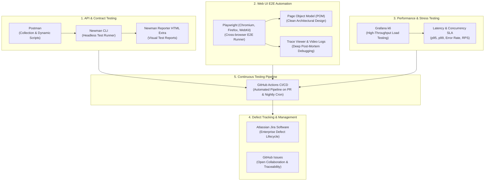

# Lumiina QA & SDET Engineering Automation Suite

**Platform Under Test (PUT)**: [Lumiina Production](https://lumiina-art.vercel.app)  
**Author**: Sandi (B.Sc. Computer Science / Cybersecurity Specialist)  
**Standards**: IEEE 829 Test Documentation, ISTQB Certified Tester Foundation, OWASP API Security Top 10  
**Test Case Matrix**: [Google Sheets Live Matrix](https://docs.google.com/spreadsheets/d/1-3cJ7OpcyEH6wcFdAwVZBZO1ayJWbJp_vnRWuhVoDbE/edit?gid=0#gid=0)

---

## Executive Summary

Repositori ini mendokumentasikan rangkaian pengujian komprehensif, arsitektur otomasi, dan jaminan mutu perangkat lunak (*Software Quality Assurance & SDET*) untuk **Lumiina**, platform galeri seni dan ilustrasi anime berbasis arsitektur Go Clean Architecture, PostgreSQL, Redis, dan React SPA.

Pengujian dirancang secara deterministik dari level integrasi fungsional (Black-Box & White-Box Analysis), validasi batas data (Equivalence Partitioning & Boundary Value Analysis), pengujian keamanan (Anti-Enumeration, Rate Limiting, Input Sanitization), hingga otomasi E2E dan performa.

---

## Metrik Eksekusi Pengujian (Module 3: Test Matrix)

| Metrik | Nilai | Keterangan |
|---|---|---|
| **Total Test Cases** | 13 | 8 Kasus Uji Auth, 5 Kasus Uji Artwork Studio |
| **Passed** | 12 | 92.3% |
| **Failed** | 1 | 7.7% (Defect TC_AUTH_001: Backend raw validator leakage) |
| **Blocked / Skipped** | 0 | 0.0% |
| **Pass Rate** | **92.3%** | Memenuhi ambang batas rilis (Release Quality Gate >= 90%) |
| **Dokumentasi Detail** | [Test Case Matrix (IEEE 829)](./01-fundamentals-and-test-cases/03-test-case-matrix-lumiina.md) | Tabel kasus uji lengkap dengan preconditions, steps, dan actual results |

---

## Ruang Lingkup Pengujian (Test Scope)

### In-Scope
1. **Authentication & Session Lifecycle**:
   - Registrasi pengguna (Happy Path, Boundary Value Analysis, Password Complexity Enforcement).
   - Login & Session State (JWT storage, User Profile Resolution, Defensive UI state).
   - Password Recovery & Security (Anti-Account Enumeration, 15-minute token TTL).
   - Rate Limiting & Brute-Force Defense (Redis token bucket per IP namespace).
2. **Artwork Publishing Studio & Feed**:
   - Unggah karya seni (MIME sniffing, client-side canvas optimization, metadata validation).
   - Validasi file negatif (Pencegahan file non-gambar dan deteksi manipulasi ekstensi/spoofing).
   - Interaksi sosial (State persistence Like/Unlike, Bookmarks, dan Comments).
   - Pembatasan hak akses tamu (Guest boundary enforcement).

### Out-of-Scope
- Sistem pembayaran / monetisasi seniman (Fitur belum tersedia di rilis saat ini).
- Pengujian kompatibilitas peramban warisan (Internet Explorer / Opera Mini).

---

## Struktur Direktori

```
lumiina-qa-automation/
├── .gitignore                          # Konfigurasi pengabaian berkas dependensi dan output pengujian
├── README.md                           # Dokumentasi utama dan ringkasan eksekutif
├── KURIKULUM_QA.md                     # Roadmap silabus QA & SDET 9 modul
├── Bug Evidence/                       # Artefak bukti kegagalan (screenshots, network logs)
│   └── 001.png                         # Bukti kegagalan TC_AUTH_001 (Alphanumeric raw error)
├── 01-fundamentals-and-test-cases/     # Modul 1-3: Catatan fundamental, desain uji, matriks IEEE 829
│   ├── 01-qa-fundamentals-notes.md     # Ringkasan STLC, level pengujian, dan 7 prinsip ISTQB
│   ├── 02-test-design-techniques-notes.md # Ringkasan teknik EP, BVA, Decision Table, State Transition
│   └── 03-test-case-matrix-lumiina.md  # Matriks kasus uji 13 baris lengkap
├── 02-bug-reports/                     # Modul 4: Laporan cacat formal (Defect reports)
├── 03-api-automation-postman/          # Modul 5: Postman collections, environments, dan Newman CLI
├── 04-e2e-automation-playwright/       # Modul 6: Skrip otomasi browser Playwright (Page Object Model)
├── 05-performance-k6/                  # Modul 7: Skrip uji beban k6 (p95 latency, throughput, stress test)
└── 06-cicd-pipeline/                   # Modul 8: Konfigurasi GitHub Actions CI pipeline
```

---

## Tumpukan Teknologi & Arsitektur Pengujian (Testing & SDET Toolchain)

Ekosistem pengujian dalam repositori ini dirancang menggunakan alat (*toolchain*) standar industri global untuk menjamin cakupan mutu menyeluruh mulai dari lapisan API, antarmuka peramban (Web UI), kinerja beban tinggi, hingga pipeline integrasi berkelanjutan (CI/CD).



---

### Rincian Alat & Peran dalam Otomasi Pengujian

#### 1. Postman & Chai JS Assertion Library
- **Kategori**: API Automation & Contract Validation.
- **Fungsi & Penerapan**:
  - Validasi menyeluruh terhadap endpoint REST API Lumiina (`/api/v1/*`).
  - Penulisan skrip asersi terprogram menggunakan JavaScript Chai assertions (`pm.test`, `pm.expect`).
  - Pengecekan status HTTP, waktu respon (SLA latensi < 300 ms), header keamanan, dan skema JSON envelope RFC 7807 (`status`, `data`, `request_id`).
  - Implementasi *Pre-request Scripts* untuk menghasilkan data acak dinamis (dynamic email, dynamic username, timestamp).
  - Implementasi *Token Chaining*: Menangkap JWT token dari alur login secara otomatis dan menginjeksinya ke header otorisasi untuk request proteksi lanjutan (Create Artwork, Like, Bookmark, Profile Update).

#### 2. Newman CLI & Newman Reporter HTML Extra
- **Kategori**: Headless API Test Runner & Reporting Engine.
- **Fungsi & Penerapan**:
  - Menjalankan koleksi pengujian Postman langsung dari baris perintah terminal Linux tanpa antarmuka grafis (GUI).
  - Integrasi native ke dalam skrip otomasi shell dan pipeline CI/CD.
  - Memproduksi laporan pengujian visual berbasis HTML interaktif (*HTML Extra Reporter*) yang memuat ringkasan eksekutif, rincian request/response per endpoint, metrik kelulusan, dan bukti kegagalan (*test evidence*) untuk audit rilis.

#### 3. Playwright (TypeScript / JavaScript)
- **Kategori**: Modern Web UI End-to-End (E2E) Automation.
- **Fungsi & Penerapan**:
  - Otomasi alur pengguna antarmuka peramban secara *cross-browser* (Chromium, Firefox, dan WebKit/Safari Engine).
  - Arsitektur **Page Object Model (POM)**: Memisahkan pemilih elemen (*locators*) dan aksi antarmuka ke dalam kelas terisolasi untuk memastikan kode otomasi mudah dirawat (*maintainable*) dan bersih dari duplikasi (*DRY*).
  - Fitur *Auto-Waiting*: Menghilangkan penggunaan jeda waktu statis (`sleep`/`wait`) dengan mekanisme penungguan otomatis hingga elemen siap untuk diinteraksi (mengeliminasi *flakiness*).
  - *Storage State & Session Reuse*: Menyimpan status login sesi pengguna sekali saja dan menggunakannya kembali di lintas pengujian untuk memangkas durasi eksekusi pengujian secara drastis.
  - *Playwright Trace Viewer*: Diagnostik mendalam berbasis DOM snapshot, perekaman video, timeline interaksi, dan log konsol browser untuk membedah kegagalan pengujian pada lingkungan *headless*.

#### 4. Grafana k6
- **Kategori**: Performance, Load, and Stress Testing.
- **Fungsi & Penerapan**:
  - Pengujian beban tinggi (*high-concurrency load testing*) berbasis kode JavaScript yang dieksekusi oleh mesin Go berkinerja ultra-tinggi.
  - Skenario pengujian beban bertahap (*Ramping VUs*), pengujian lonjakan trafik mendadak (*Spike Testing*), pengujian batas daya tampung sistem (*Stress Testing*), dan pengujian ketahanan durasi panjang (*Soak Testing*).
  - Evaluasi metrik kuantitatif terhadap arsitektur backend Go & PostgreSQL: throughput (*Requests Per Second*), ambang batas latensi *p95* dan *p99*, serta tingkat kesalahan koneksi (*error rate*).

#### 5. Atlassian Jira Software & GitHub Issues
- **Kategori**: Defect Lifecycle & Test Management.
- **Fungsi & Penerapan**:
  - Manajemen cacat perangkat lunak (*bug tracking*) dengan alur Kanban deterministik: `To Do` -> `In Progress` -> `In Review` -> `Done`.
  - Klasifikasi formal berdasarkan matriks **Severity** (Critical, Major, Minor, Trivial) dan **Priority** (P1, P2, P3, P4).
  - Dokumentasi cacat berbasis standar industri: judul spesifik, lingkungan uji, *Steps to Reproduce (STR)*, hasil yang diharapkan vs aktual, serta bukti log dan tangkapan layar.
  - Sinkronisasi pelacakan tiket internal (*Jira LUM-X*) dengan repositori publik (*GitHub Issues #X*).

#### 6. GitHub Actions
- **Kategori**: Continuous Integration & Continuous Testing (CI/CD).
- **Fungsi & Penerapan**:
  - Orkestrasi otomatisasi pengujian berbasis event: eksekusi pengujian otomatis saat terjadi `git push` atau `pull_request` menuju branch `develop` dan `main`.
  - *Nightly Scheduled Regression Run*: Eksekusi rangkaian uji regresi menyeluruh secara berkala menggunakan cron job terjadwal.
  - Pengarsipan otomatis dan penerbitan artefak laporan HTML pengujian sebagai rujukan kualitas tim rekayasa perangkat lunak.

---

### Matriks Evaluasi & Rasional Pemilihan Tools

| Alat / Teknologi | Alternatif Konvensional | Rasional Pemilihan & Keunggulan Teknis |
|---|---|---|
| **Postman + Newman** | cURL scripts, manual GUI | Memisahkan konfigurasi lingkungan secara bersih (*Environment variables*), mendukung asersi Chai JS standar industri, serta memiliki ekosistem runner CLI (*Newman*) yang matang untuk CI/CD. |
| **Newman HTML Extra** | Standard Newman CLI log | Menghasilkan dasbor HTML visual mandiri dengan visualisasi interaktif yang siap diserahkan kepada *stakeholder* non-teknis maupun tim pengembang. |
| **Playwright** | Selenium, Cypress | Mendukung eksekusi paralel multi-browser (termasuk WebKit asli), arsitektur berbasis WebSocket dua arah yang bebas *polling delay*, auto-waiting deterministik, dan isolasi konteks peramban super cepat. |
| **Grafana k6** | Apache JMeter, Locust | Ditulis dalam Go dengan penggunaan memori yang jauh lebih efisien dibanding JVM pada JMeter, skrip uji berbasis kode (*Test as Code*) yang ramah Git, serta integrasi CI/CD tanpa runtime dependensi berat. |
| **Jira & GitHub Issues** | Spreadsheet defect log | Memiliki status alur kerja (*lifecycle state*) yang jelas, riwayat audit komprehensif, pelabelan severity/priority terstandar, dan integrasi langsung ke sistem version control. |
| **GitHub Actions** | Jenkins mandiri | Terintegrasi langsung dengan repositori GitHub tanpa overhead pemeliharaan server CI terpisah, mendukung parallel matrix jobs, dan pengarsipan artefak instan. |

---

### Peta Implementasi per Modul

| Modul | Fokus Pengujian | Tumpukan Alat Utama | Status |
|---|---|---|---|
| **Modul 1** | QA Fundamentals & Test Mindset | Teori ISTQB, SDLC/STLC, Standar IEEE 829 | Selesai |
| **Modul 2** | Test Design Techniques (EP & BVA) | Equivalence Partitioning, Boundary Value Analysis, Decision Table | Selesai |
| **Modul 3** | Test Documentation & Test Matrix | Google Sheets, IEEE 829 Test Matrix | Selesai |
| **Modul 4** | Defect Lifecycle & Bug Tracking | Jira Software, GitHub Issues, Markdown Defect Specs | Selesai |
| **Modul 5** | API Automation Testing | Postman, Chai JS, Newman CLI, Newman Reporter HTML Extra | Siap Dijalankan |
| **Modul 6** | Web UI E2E Automation | Playwright (Chromium/Firefox/WebKit), TypeScript, Page Object Model | Mendatang |
| **Modul 7** | Performance & Stress Testing | Grafana k6, Latency SLA Metrics (p95/p99) | Mendatang |
| **Modul 8** | QA CI/CD Pipeline | GitHub Actions, Automated Workflow, Artifact Publishing | Mendatang |
| **Modul 9** | Portfolio & Interview Mastery | Comprehensive Test Artifacts, Technical Interview Drill | Mendatang |

